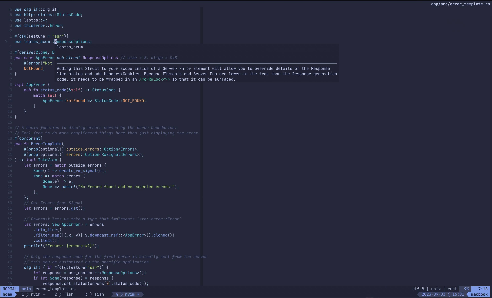

# Neovim Config

My Minimalist Neovim config.
Banish those unworthy [soydev](https://storopoli.io/2023-11-10-2023-11-13-soydev/)
IDEs to the depths of Hell!

## Dependencies

- Neovim:
  - `neovim`
  - `fzf`
  - `ripgrep`
  - `fd`
- LSPs:
  - `bash-language-server`
  - `typescript-language-server`
  - `rust-analyzer`
  - `gopls`
  - `vscode-langservers-extracted`
  - `pyright`
  - `ruff-lsp`
  - `lua-language-server`
  - `taplo`
  - `yaml-language-server`
  - `marksman`
  - `ltex-ls`
  - `texlab`
  - `typst-lsp`
- Linters:
  - `shellcheck`
  - `luacheck`
  - `ruff`
  - `eslint`
  - `luacheck`
- Formatters:
  - `dprint`
  - `prettierd`
  - `isort`
  - `black`
  - `shfmt`
  - `shellharden`
  - `stylua`
  - `typstfmt`
