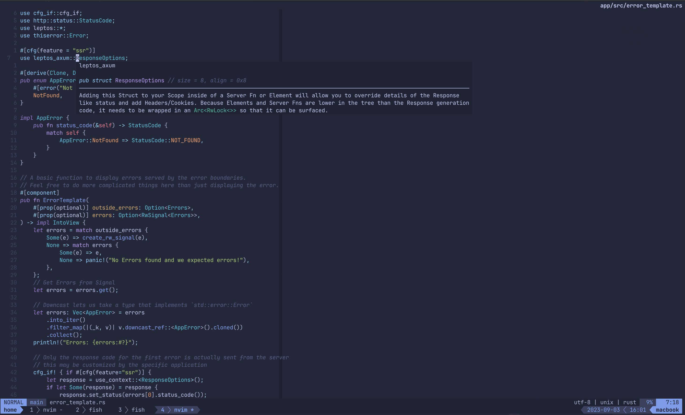

# Neovim Config

[](https://opensource.org/licenses/MIT)

My Minimalist Neovim config.
Banish those unworthy [soydev](https://storopoli.io/2023-11-10-2023-11-13-soydev/)
IDEs to the depths of Hell!



## Dependencies

- Neovim:
  - `neovim`
  - `fzf`
  - `ripgrep`
  - `fd`
- LSPs:
  - `bash-language-server`
  - `typescript-language-server`
  - `rust-analyzer`
  - `gopls`
  - `julials`
  - `vscode-langservers-extracted`
  - `pyright`
  - `lua-language-server`
  - `nil`
  - `taplo`
  - `yaml-language-server`
  - `marksman`
  - `ltex-ls`
  - `typst-lsp`
- Linters:
  - `shellcheck`
  - `luacheck`
  - `ruff`
  - `eslint_d`
- Formatters:
  - `markdownlint-cli2`
  - `prettierd` or `prettier`
  - `isort`
  - `black`
  - `shfmt`
  - `shellharden`
  - `stylua`
  - `nixpkgs-fmt`
  - `typstfmt`

## Local Configurations with `exrc`

Local settings can be configured by  creating a `.nvim.lua` file in the project's
root directory.
If neovim is launched in the same directory as `.nvim.lua`,
it will evaluate your user configuration first,
followed by the local configuration.

An example `.nvim.lua` might be as follows:

```lua
local nvim_lsp = require('lspconfig')

nvim_lsp.rust_analyzer.setup({
  root_dir = function()
    return vim.fn.getcwd()
  end
})
```

## Nix Alternative

One can use the same configs here with one-liner:

```bash
nix run github:storopoli/neovix
```

or add to your flake.

Check [`storopoli/neovix`](https://github.com/storopoli/neovix) for more details.

## Neovimer's Creed

This is my neovim config.
There are many like it, but this one is mine.

My neovim config is my best friend.
It is my life.
I must master it as I must master my life.

Without me, my neovim config is useless.
Without my neovim config, I am useless.
I must edit my neovim config true.
I must code more efficiently than my enemy who is trying to outcode me.
I must outcode him before he outcodes me.
I will...

My neovim config and I know that what counts in coding is not the plugins we install,
the noise of our mechanical keyboards,
nor the smoke tests we run.
We know that it is the commits that count.
We will commit...

My neovim config is human, even as I, because it is my life.
Thus, I will learn it as a brother.
I will learn its weaknesses, its strength, its parts, its accessories,
its themes, and its plugins.
I will keep my neovim config clean and ready, even as I am clean and ready.
We will become part of each other.
We will...

Before Git, I swear this creed.
My neovim config and I are the defenders of my codebase.
We are the masters of our enemy.
We are the saviors of my projects.

So be it, until victory is Open Source's and there is no enemy, but peace!

## License

The source code is licensed under a
[MIT License](https://opensource.org/license/mit/).

[](https://opensource.org/license/mit/)
